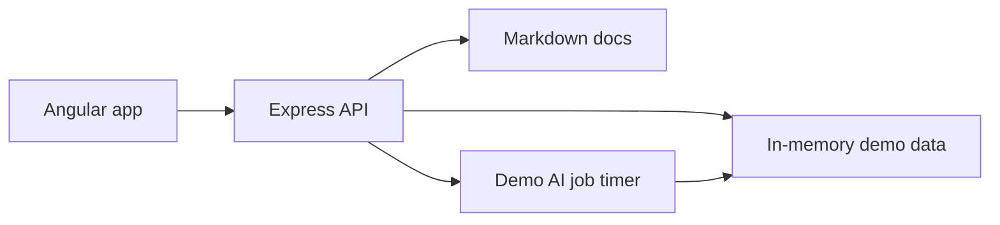

# Forecasting AI POC Architecture

## Summary

This project is a proof of concept for AI-assisted unit forecasting inside an ERP-style workflow. The current implementation uses an Angular frontend with a Node/Express API backend. The app starts with seeded demo ERP data, lets users upload forecast-unit CSVs for known item codes, and runs deterministic demo AI jobs that add product/month findings to the forecast chart.

The original Python modules are retained as reference helpers and tests, but the browser workflow no longer depends on a Python web server.

## Stack

- Angular frontend in `frontend/`
- Express API backend in `backend/server.js`
- In-memory seeded demo data for the local POC
- Chart.js for the rolling forecast chart
- Multer for CSV uploads
- `csv-parse` for CSV parsing

## Runtime Flow



The Angular app calls only the Express API. The frontend does not call AI providers or parse uploaded CSVs directly.

## HTTP Interface

- `GET /api/forecast`
  - Returns the active forecast workspace, product chart payloads, table values, visible months, and completed findings.
- `POST /api/forecasts`
  - Accepts a multipart `forecast_file`, validates it, and applies forecast-unit updates for known item codes.
- `POST /api/ai-jobs`
  - Creates a queued demo AI job from forecast context and blind spots.
- `GET /api/ai-jobs/:jobId`
  - Returns job status and completed finding payloads.
- `GET /forecasts/template.csv`
  - Downloads a forecast-unit CSV template for the seeded products.
- `GET /docs`
  - Lists project documents.
- `GET /docs/:docName`
  - Returns an allowed document as plain text.

## CSV Format

The CSV upload is optional. Product data is fixed for the POC, so the CSV only updates forecast units for existing ERP item codes.

Required columns:

- `item_code`: must match an existing seeded product.

Forecast columns:

- Use `YYYY-MM` month format.
- Values are integer unit counts.
- The default template includes 12 months starting with the current month.

Example:

```csv
item_code,2026-05,2026-06,2026-07
CHANEL-N5-EDP,1280,1360,1425
DIOR-SAUV-EDP,1760,1810,1735
```

## AI Job Behavior

The Express backend currently uses deterministic demo findings so the POC runs offline. A submitted AI job transitions from `queued` to `running` to `completed`, then returns findings grouped by product database ID and forecast month. The Angular chart renders those findings as clickable month markers.

Recommended statuses:

- Forecast upload: `active`, `failed`
- AI job: `queued`, `running`, `completed`, `failed`

## Data Shape

The Angular app expects this core workspace shape:

```json
{
  "forecast": {
    "id": 1,
    "original_filename": "Demo ERP forecast",
    "status": "active",
    "created_at": "2026-05-08T00:00:00.000Z",
    "error_message": null
  },
  "months": ["2026-05"],
  "products": [],
  "values_by_product": {},
  "findings": {}
}
```

Findings are grouped as:

```json
{
  "1": {
    "2026-05": [
      {
        "type": "consideration",
        "description": "Demand signal text.",
        "impact": 2
      }
    ]
  }
}
```

## Testing

Primary checks:

- `node --check backend/server.js`
- `npm --prefix frontend run build`
- `python -m pytest`

Future backend tests should cover:

- CSV parser validation.
- Forecast template generation.
- Forecast upload updates.
- AI job status transitions.
- Completed finding payload shape.
