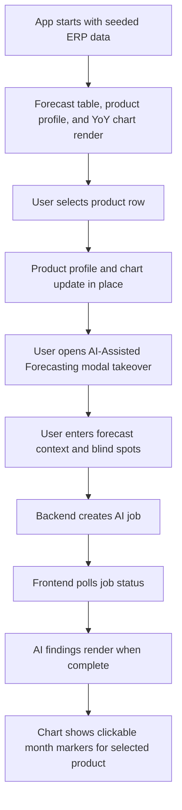
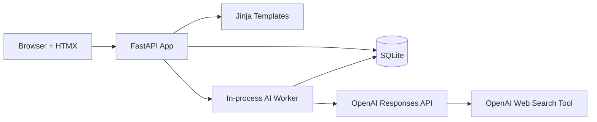
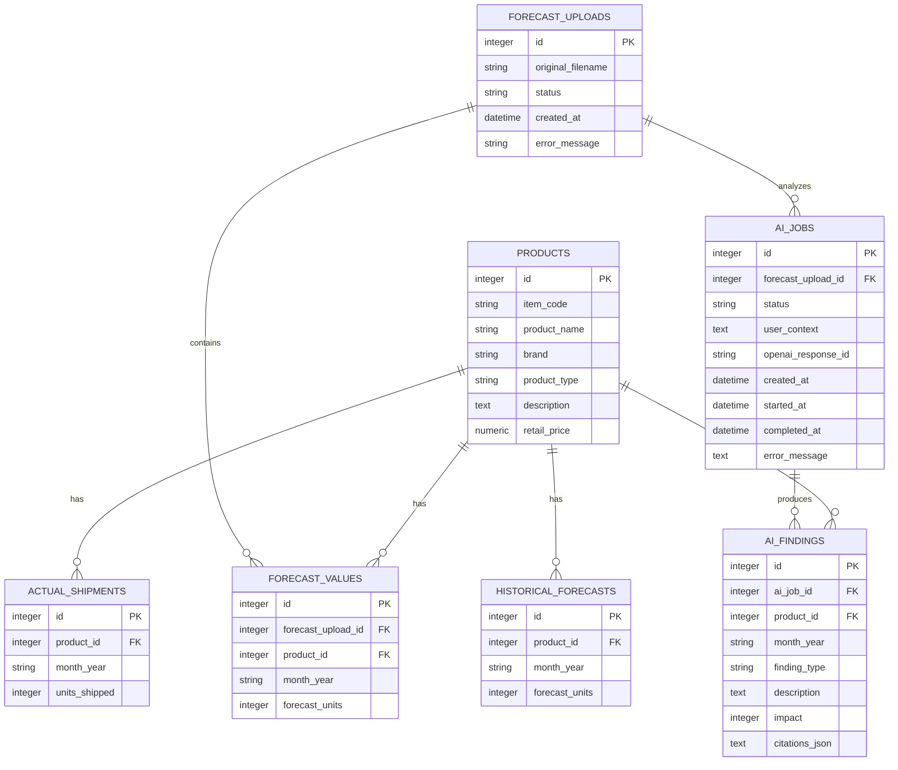
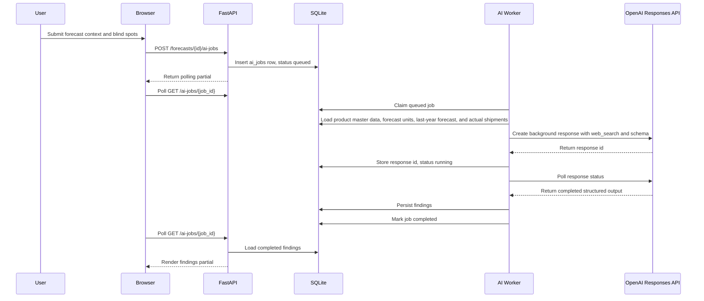

# Sales Forecasting AI POC Architecture

## Summary

This project is a proof of concept for AI-assisted unit forecasting inside an ERP-style workflow. The app starts with seeded demo ERP data: product master data, actual units shipped by month, historical forecast units, and a rolling 12-month future forecast. Users inspect the forecast, select products for a YoY chart, and run an AI-assisted analysis that looks for external considerations and real-world sell-through actions that may affect future unit demand.

The first implementation should optimize for demo clarity and backend simplicity:

- FastAPI backend
- SQLite database
- SQLAlchemy or SQLModel persistence layer
- Server-rendered Jinja templates with HTMX interactions
- Minimal JavaScript only where useful for charts
- OpenAI Responses API for AI analysis
- In-process background worker for POC async jobs

For the POC, use the OpenAI Responses API directly rather than the full Agents SDK. The Responses API already provides the needed primitives: background execution, structured outputs, web search, tool use, and polling. The Agents SDK can be introduced later if the app needs multi-agent handoffs, richer tracing, or custom runtime tools.

Relevant OpenAI docs:

- Responses API: https://platform.openai.com/docs/guides/responses-vs-chat-completions
- Background mode: https://platform.openai.com/docs/guides/background
- Structured Outputs: https://platform.openai.com/docs/guides/structured-outputs?api-mode=responses&lang=python
- Web search tool: https://platform.openai.com/docs/guides/tools-web-search?api-mode=responses

## Goals

The POC should demonstrate:

- Starting from realistic seeded ERP data.
- Maintaining fixed product master data.
- Optionally updating forecast units by CSV for known item codes.
- Visualizing forecast unit data as a table.
- Keeping a product forecast line chart visible above the table.
- Updating the chart when the user selects a product row.
- Showing the selected product's brand, type, description, retail price, and item code.
- Collecting user-written forecast assumptions and blind spots.
- Running an async AI analysis over the forecast.
- Returning normalized AI findings by product and month.
- Persisting results so the frontend can poll and render them.
- Showing available AI findings as footnote markers on the chart.
- Depicting finding impact as a signed `-3` to `+3` score with visual emoji treatment.

The POC does not need:

- Authentication or authorization.
- Multi-tenant data isolation.
- ERP integration.
- Durable external job queues.
- Dockerized services.
- Highly accurate forecasting math.
- Long-term historical storage.

## User Workflow



## CSV Format

The CSV upload is optional. Product data is fixed for the POC, so the CSV only updates forecast units for existing ERP item codes.

Required columns:

- `item_code`: must match an existing seeded product.

Forecast columns:

- Use `YYYY-MM` month format.
- Example: `2026-05`, `2026-06`, `2026-07`.
- Values are integer unit counts.
- The default template should include 12 months starting with the current month when generated.

Example:

```csv
item_code,2026-05,2026-06,2026-07
CHANEL-N5-EDP,1280,1360,1425
DIOR-SAUV-EDP,1760,1810,1735
```

## Application Architecture



The browser should interact only with the FastAPI app. The frontend should not call OpenAI directly.

FastAPI responsibilities:

- Serve HTML pages and partials.
- Serve the CSV template.
- Seed demo ERP data.
- Accept forecast-unit CSV updates for known products.
- Parse and validate integer unit forecasts.
- Create AI jobs.
- Expose job polling endpoints.

Worker responsibilities:

- Claim queued jobs.
- Build the AI prompt from forecast data and user context.
- Start a background OpenAI response.
- Poll OpenAI until terminal status.
- Parse structured output.
- Persist findings.
- Mark jobs as complete or failed.

## Data Model



Recommended statuses:

- Forecast upload: `active`, `failed`
- AI job: `queued`, `running`, `completed`, `failed`, `cancelled`

Product metadata is modeled as fixed ERP product fields for the POC.

## HTTP Interface

Initial routes:

- `GET /`
  - Redirect to the seeded active forecast.
- `GET /forecasts/template.csv`
  - Download a forecast-unit CSV template for existing item codes.
- `POST /forecasts`
  - Upload, parse, validate, and apply forecast-unit CSV updates.
- `GET /forecasts/{forecast_id}`
  - Render the forecast table, visible chart, product-row selection state, and AI marker data.
- `POST /forecasts/{forecast_id}/ai-jobs`
  - Create an AI analysis job from modal submission.
- `GET /ai-jobs/{job_id}`
  - Return an HTML partial for HTMX polling.
- `GET /ai-jobs/{job_id}.json`
  - Return machine-readable job state for debugging.

HTMX polling should target `GET /ai-jobs/{job_id}` so the server can decide what partial to render for queued, running, failed, and completed states.

## AI-Assisted Forecasting Flow



## AI Request Pattern

Use a single structured analysis request for the initial POC.

The request should include:

- Forecast upload ID.
- Product rows with item code, name, brand, type, description, retail price, current forecast units, last-year forecast units, and last-year actual units.
- Customer context, including assumed retail channel, demo market, and any account/geography notes supplied by the user.
- User's context about what the forecast already accounts for.
- User's requested blind spots.
- Instruction to act as a product-market researcher, not just a forecast commentator.
- Instruction to research actual products, scent profiles, brand positioning, seasonality, cultural moments, regional events, social trends, retail behavior, and adjacent category signals.
- Instruction to return no finding when the model does not have a specific, useful, product-relevant insight.
- Instruction that recommendations must be sell-through actions, not instructions to adjust forecast units, allocation, replenishment, production, or inventory quantities.
- Strict structured output schema.

Use OpenAI web search for current external signals such as:

- Regional events.
- Public product or category trends.
- Celebrity or influencer relevance.
- Seasonality and holidays.
- Weather or climate patterns when relevant.
- Economic and supply-chain signals.
- Local disruption or policy changes.

The prompt should avoid claiming certainty and should prefer an empty result over generic advice. Considerations should describe researched demand factors or risks, not observations about the forecast shape. Recommendations should be real-world sales actions that could improve sell-through, such as merchandising, placement, bundles, channel outreach, promotional timing, display support, clienteling, sampling, advisor education, or marketing tests.

## Structured AI Output

The model response should conform to this shape:

```json
{
  "findings": [
    {
      "product_id": "CHANEL-N5-EDP",
      "month_year": "2026-06",
      "considerations": [
        {
          "description": "Father's Day can pull prestige fragrance traffic toward men's gifts, which may make Chanel N°5 less visible unless the account keeps a classic luxury gift story active.",
          "impact": -1
        }
      ],
      "recommendations": [
        {
          "description": "Use advisor-led clienteling for shoppers who bought Chanel gift sets last holiday season, positioning N°5 as a classic personal gift rather than a broad seasonal display.",
          "impact": 2
        }
      ],
    },
    {
      "product_id": "DIOR-SAUV-EDP",
      "month_year": "2026-06",
      "considerations": [
        {
          "description": "June includes Father's Day, and Sauvage's broad men's-fragrance awareness makes it a high-intent gifting candidate.",
          "impact": 3
        }
      ],
      "recommendations": [
        {
          "description": "Run a Father's Day counter program with fast gift wrapping, scent-strip cards, and a clear premium men's gift position.",
          "impact": 2
        }
      ]
    }
  ]
}
```

Schema rules:

- `product_id` must match an existing ERP item code.
- `month_year` should usually match a current forecast month. If OpenAI returns a known product with an out-of-window month, persist it as nonblocking metadata; the current chart only renders findings for visible forecast months.
- `impact` is a signed integer from `-3` to `+3`.
- Negative impact means expected downward pressure.
- Positive impact means expected upward pressure.
- `0` means relevant but uncertain or neutral.
- Do not use dollar impact. This POC forecasts units.

Persist each consideration and recommendation as a separate `ai_findings` row with `finding_type` set to `consideration` or `recommendation`.

## Source Handling

When OpenAI web search is used, response annotations or returned sources should be captured where possible and stored in `citations_json`.

Any source shown in the UI should be:

- Visible.
- Clickable.
- Associated with the finding it supports when possible.

If a recommendation is speculative and not directly source-backed, the UI should make that clear by omitting citations rather than inventing them.

## Frontend Plan

Use server-rendered templates for the main UI:

- `base.html`
- `index.html`
- `forecast_detail.html`
- `_ai_job_status.html`
- `_ai_findings.html`

Use HTMX for:

- Submitting the AI job form.
- Polling job status.
- Replacing the status/results panel.

Use a native dialog for the AI modal takeover. Use Chart.js for the persistent forecast chart above the table, and a small custom Chart.js plugin to draw footnote markers beside the month labels when the selected product has AI findings for that month. Clicking a marker toggles a notes box with separate Considerations and Recommendations sections. Opening a second marker, switching products, or clicking away closes the currently open notes box. Each item should show its signed `-3` to `+3` impact with an emoji.

## Error Handling

CSV upload errors:

- Missing `item_code`.
- Duplicate `item_code` within the same upload.
- No valid forecast month columns.
- Invalid integer forecast units.
- Invalid month column format.
- Unknown item code.

AI job errors:

- OpenAI API key missing.
- OpenAI request rejected.
- Background response cancelled or expired.
- Model refusal.
- Structured output parse failure.
- Product or month not found in the active forecast.

Failed jobs should preserve an error message for the UI and debugging.

## Testing Plan

Parser tests:

- Valid pivot CSV parses into item-code forecast updates.
- Invalid month columns are rejected.
- Missing item codes are rejected.
- Duplicate item codes are rejected.
- Non-integer or negative forecast units are rejected.

Template tests:

- Template includes `item_code`.
- Template includes 12 month columns.
- Generated month columns are chronological.

Route tests:

- Root route redirects to the active seeded forecast.
- Upload route updates forecast units for fixed products.
- Forecast detail route renders table rows.
- Forecast detail route exposes product profile data and rolling YoY chart data.
- Product row selection updates the visible chart without navigating.
- Completed AI findings appear as clickable chart marker data.
- AI job route creates a queued job.
- AI polling route renders queued, running, failed, and completed states.

Worker tests:

- Queued job is claimed once.
- Successful structured output creates findings.
- Invalid product IDs from AI output are ignored so one bad row does not fail the whole job.
- Known products with out-of-window months are persisted, though the current chart may not render them.
- Refusals and API failures mark the job failed.

AI integration tests:

- Use a mocked OpenAI client by default.
- Keep one optional live test behind an environment flag such as `RUN_OPENAI_INTEGRATION_TESTS=1`.

## Rollout Path

Phase 1:

- Build seeded product, actual shipment, historical forecast, and current forecast data.
- Render forecast workspace by default.

Phase 2:

- Add forecast-unit CSV update path, persistent YoY chart, product profile, product-row chart selection, AI modal, and job creation.

Phase 3:

- Add worker loop and mocked AI result persistence.
- Add OpenAI Responses API integration.

Phase 4:

- Add citations, failure states, and demo polish.

Future upgrades:

- Replace in-process worker with a durable queue.
- Add authentication and tenant isolation.
- Add ERP import/export integration.
- Replace seeded historical data with ERP-backed historical data.
- Add file search or vector stores for customer-specific product catalogs.
- Adopt the OpenAI Agents SDK if multi-agent orchestration becomes useful.

## Implementation Defaults

- Treat seeded ERP data and forecast overrides as local POC data.
- Store all timestamps in UTC.
- Use `YYYY-MM` strings for forecast months in the POC.
- Use integer columns for unit forecasts and actual shipments.
- Use JSON text columns for citations.
- Poll AI jobs from the frontend every 2 seconds while queued or running.
- Keep AI findings concise enough to scan in a table.
- Prefer clear demo behavior over premature scalability.
